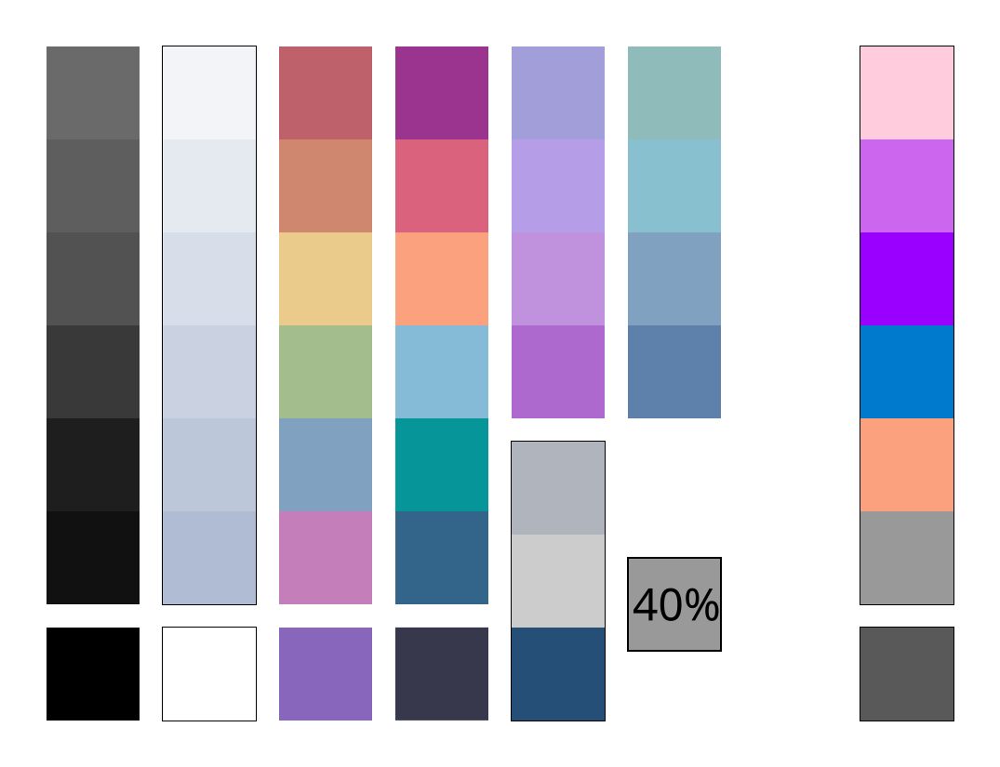

# My custom colour scheme

The colours are based on the [Nord](www.nordtheme.com) theme and the colours from the [Pastel Powerline](https://starship.rs/presets/pastel-powerline) starship preset.

# Colour Tables

| Index | Polar     | Snow      | Power     | Aurora    | Mana      | Frost     |
| :---: | :-------: | :-------: | :-------: | :-------: | :-------: | :-------: |
| 0     | #111111 | #f2f4f7 | #9a348e | #bf616a | #7654a8 | #5e81ac |
| 1     | #1e1e1e | #e5e9f0 | #da627d | #d08770 | #8866bb | #81a1c1 |
| 2     | #393939 | #d8dee9 | #fca17d | #ebcb8b | #917bc6 | #86bbd8 |
| 3     | #525252 | #cad2e1 | #06969a | #a3be8c | #aa8ddf | #88c0d0 |
| 4     | #5e5e5e | #bdc7da | #33658a | #c47eba | #af7ccd | #8fbcbb |
| 5     | #6a6a6a | #b0bcd3 | #38384d | --        | --        | --        |

| Black     | White     | Gray      | Text      |
| :-------: | :-------: | :-------: | :-------: |
| #000000 | #ffffff | #b0b4bc | #cccccc |

- Shadow is black at 40% opacity: #00000066
- Highlight is white at 15% opacity: #ffffff26

Mana-2 and Frost-1 are also treated as members of the Aurora palette where applicable.
